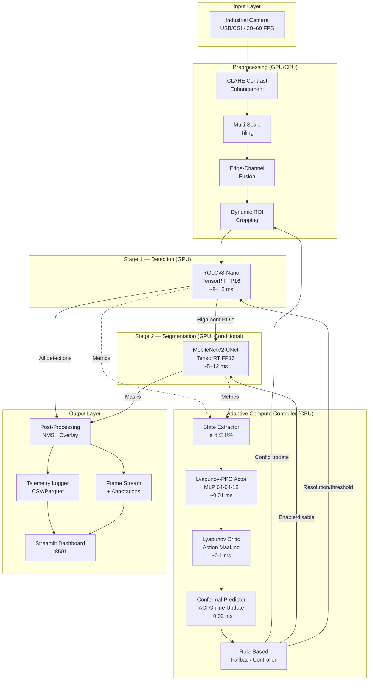
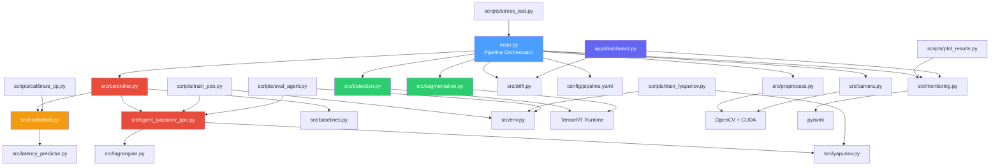
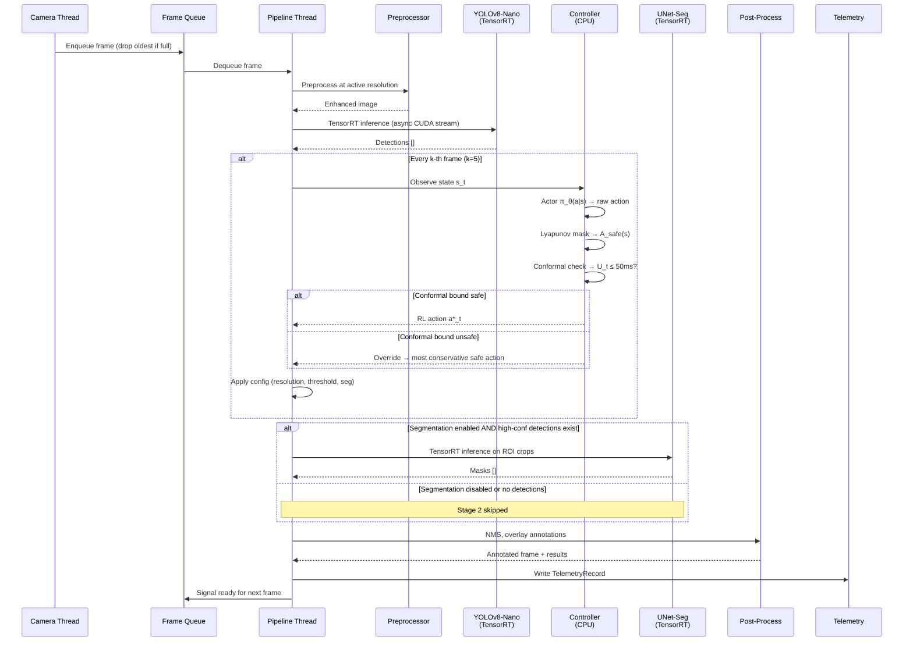
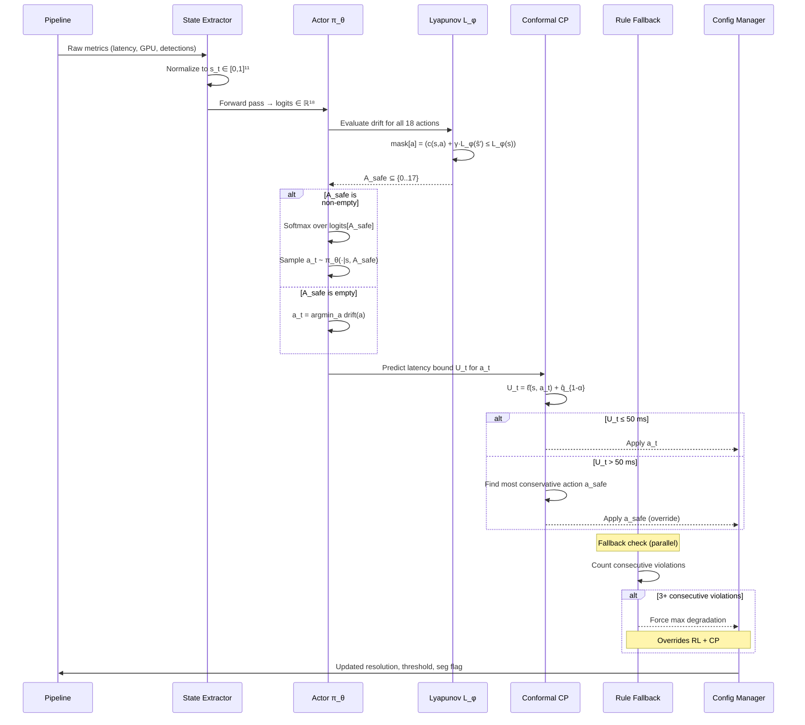
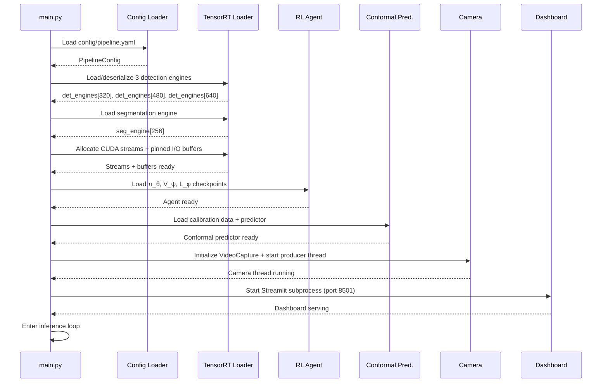
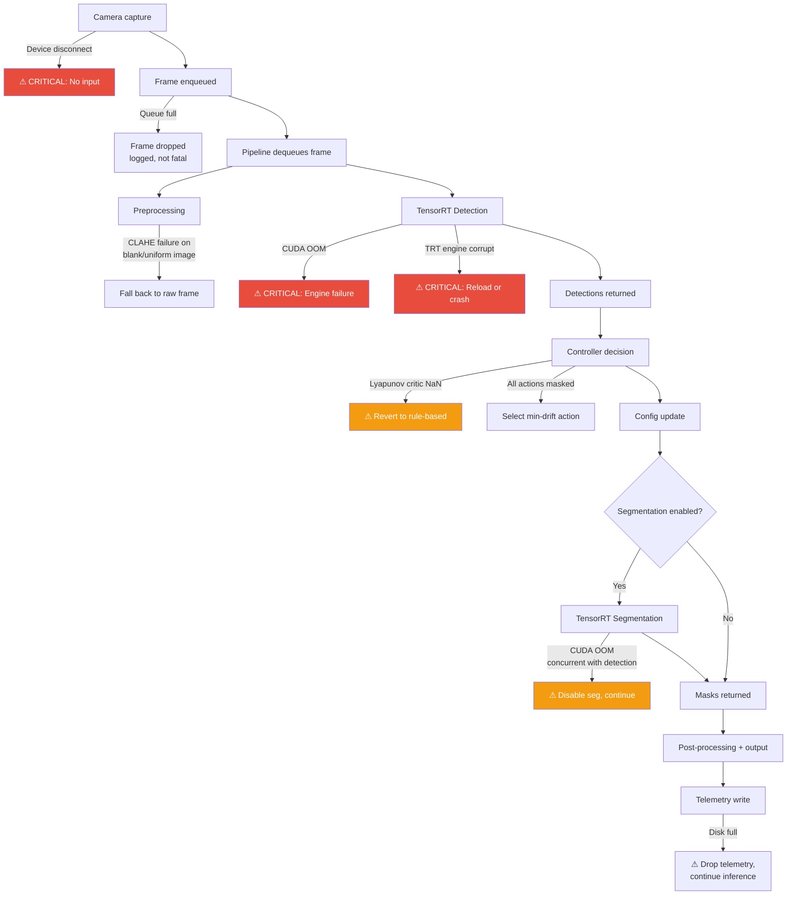
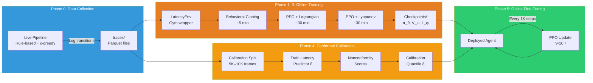
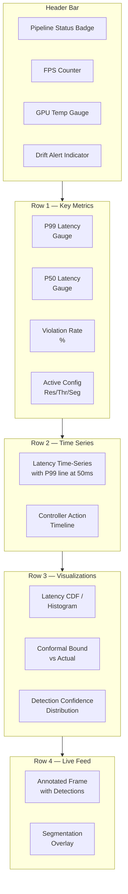
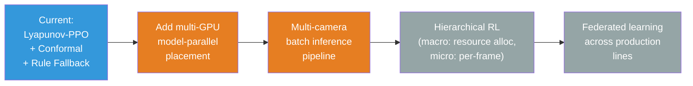

# Lyapunov-Constrained RL for Latency-Bounded Edge Inference — Technical Documentation

> **Version:** 1.0  
> **Last updated:** 2026-02-19  
> **Language / Runtime:** Python 3.10+ · PyTorch 2.x · TensorRT 8.6 · CUDA 11.8 · Streamlit 1.30+  
> **Architecture style:** Cascaded real-time inference pipeline with learned adaptive compute controller and formal safety certificates  

---

## Table of Contents

1. [System Overview](#1-system-overview)  
2. [Architecture Breakdown](#2-architecture-breakdown)  
3. [Domain Model](#3-domain-model)  
4. [Execution Flow](#4-execution-flow)  
5. [Adaptive Compute Controller — Constrained MDP](#5-adaptive-compute-controller--constrained-mdp)  
6. [Lyapunov Safety Layer](#6-lyapunov-safety-layer)  
7. [Conformal Prediction Certificate](#7-conformal-prediction-certificate)  
8. [Key Design Decisions](#8-key-design-decisions)  
9. [Failure & Edge Case Analysis](#9-failure--edge-case-analysis)  
10. [Training & Evaluation Pipeline](#10-training--evaluation-pipeline)  
11. [Frontend Dashboard](#11-frontend-dashboard)  
12. [Developer Onboarding Guide](#12-developer-onboarding-guide)  
13. [Security & Operational Considerations](#13-security--operational-considerations)  
14. [Suggested Improvements](#14-suggested-improvements)  

---

## 1. System Overview

### Purpose

This system is a **production-grade, latency-bounded real-time defect detection pipeline** designed for industrial manufacturing environments (metal sheets, PCBs, textiles, glass). Unlike conventional CV pipelines that optimize for accuracy alone, this system enforces a **hard P99 per-frame latency budget of 50 ms** on constrained GPU hardware (NVIDIA RTX 3050, 4 GB VRAM) while maintaining ≥ 80% of baseline detection accuracy under overload.

The core innovation is a **three-layer adaptive compute controller**:

1. **Lyapunov-PPO Agent** — A tiny reinforcement learning policy that dynamically selects degradation actions (resolution reduction, segmentation skipping, confidence threshold adjustment) based on real-time system telemetry.
2. **Conformal Prediction Safety Certificate** — A distribution-free statistical layer providing formal P99 latency guarantees with online adaptation to distribution shift.
3. **Rule-Based Fallback** — A deterministic emergency controller activated when the learned layers fail, ensuring absolute safety.

This dual guarantee architecture (learned optimization + statistical certification) is absent from existing industrial CV literature and represents the primary research contribution.

### High-Level Architecture



### Core Responsibilities

| Responsibility | Owner |
|---|---|
| Frame acquisition at target FPS | Camera I/O thread (producer) |
| Contrast enhancement & ROI extraction | Preprocessing module |
| Fast anomaly localization (bounding boxes) | YOLOv8-Nano TensorRT engine (Stage 1) |
| Pixel-level defect segmentation (conditional) | MobileNetV2-UNet TensorRT engine (Stage 2) |
| Runtime compute allocation decisions | Lyapunov-PPO adaptive controller |
| Formal P99 latency upper-bounding | Conformal prediction safety layer |
| Emergency deterministic fallback | Rule-based controller |
| Per-frame telemetry & drift detection | Monitoring module |
| Operator visualization & alerting | Streamlit dashboard |
| Offline RL training & evaluation | Training pipeline |

---

## 2. Architecture Breakdown

### Major Components

#### Camera I/O Layer (`src/camera.py`)

A dedicated producer thread that captures frames from USB/CSI cameras using OpenCV's `VideoCapture` with a bounded queue. Implements backpressure: if the inference pipeline is slower than the camera, frames are dropped at the source (newest-wins policy) rather than accumulating unbounded memory.

Key design points:
- **Pinned memory** allocation via `cv2.cuda.HostMem` for zero-copy GPU transfers
- **Async capture** in a daemon thread with `threading.Event` for graceful shutdown
- **Frame timestamping** at acquisition time (not processing time) for accurate latency measurement
- **Resolution passthrough** — raw frames are not resized here; the controller dictates resolution downstream

#### Preprocessing Module (`src/preprocess.py`)

Performs image enhancement and region extraction before inference. All operations target reduction of compute on non-informative regions.

| Operation | Purpose | Typical Cost |
|---|---|---|
| CLAHE (Contrast Limited Adaptive Histogram Equalization) | Normalize lighting variance across production environments | 0.5–1.5 ms |
| Multi-scale tiling | Split high-resolution inputs into overlapping tiles for small-defect sensitivity | 0.2–0.5 ms |
| Edge-channel fusion | Append Canny/Sobel edge map as an additional input channel for texture defects | 0.3–0.8 ms |
| Dynamic ROI cropping | Crop input to regions of interest based on prior-frame detections or fixed masks | 0.1–0.3 ms |

The controller can bypass tiling and edge-channel fusion during overload, reducing preprocessing cost by ~40%.

#### Stage 1 — Detection Engine (`src/detection.py`)

A YOLOv8-Nano model exported to ONNX and compiled into a TensorRT FP16 engine for maximum throughput on the RTX 3050.

| Property | Value |
|---|---|
| Model | YOLOv8n (Ultralytics) |
| Input resolution | 640 × 640 (default), 480 × 480, 320 × 320 (degraded) |
| Precision | FP16 (TensorRT) |
| Batch size | 1 (latency-optimized) |
| Weight size | ~6 MB (FP16 engine) |
| Typical latency | 8–15 ms (resolution-dependent) |
| Output | Bounding boxes, class IDs, confidence scores |
| VRAM footprint | ~200–400 MB (including I/O buffers) |

The engine is pre-allocated at startup with fixed input/output buffer sizes for each supported resolution. Resolution switching does not require engine rebuild — three engines are pre-compiled to memory and selected at runtime.

#### Stage 2 — Segmentation Engine (`src/segmentation.py`)

A lightweight MobileNetV2-UNet (or BiSeNetV2 alternative) compiled to TensorRT FP16. Runs **conditionally** — only on ROI crops where Stage 1 detected anomalies with confidence above a tunable threshold.

| Property | Value |
|---|---|
| Model | MobileNetV2-UNet (encoder: MobileNetV2, decoder: 3-level U-Net) |
| Input resolution | ROI crop, resized to 256 × 256 |
| Precision | FP16 (TensorRT) |
| Batch size | 1 (per ROI, sequential) |
| Weight size | ~10 MB (FP16 engine) |
| Typical latency | 5–12 ms per ROI |
| Output | Binary or multi-class segmentation mask |
| VRAM footprint | ~300–500 MB |

When the controller disables Stage 2, the pipeline returns bounding-box-only detections, saving 5–12 ms per frame.

#### Adaptive Compute Controller (`src/controller.py`)

The learned policy that replaces the traditional rule-based controller. Consists of three stacked layers:

```
Layer 3 (outermost): Rule-Based Fallback
    └── Activated if 3+ consecutive latency violations
    └── Forces most aggressive degradation config
    └── Deterministic, zero inference cost

Layer 2: Conformal Prediction Safety Override
    └── Predicts upper-bound latency for proposed action
    └── Overrides RL action if P(violation) > threshold
    └── Distribution-free guarantees via ACI

Layer 1 (innermost): Lyapunov-PPO Agent
    └── Optimizes detection quality subject to latency constraint
    └── Lyapunov action masking for per-step safety
    └── Tiny MLP, ~6K params, < 0.01 ms inference
```

The controller runs on CPU, in parallel with GPU inference. It makes a decision every $k$ frames ($k = 5$ by default), since thermal and queue dynamics change on ~100–200 ms timescales, not per-frame.

#### Telemetry & Monitoring (`src/monitoring.py`)

Collects, stores, and exposes per-frame metrics for both runtime decisions and offline analysis.

| Metric | Collection Method | Use |
|---|---|---|
| Per-frame latency (ms) | `time.perf_counter_ns()` around pipeline stages | P50/P95/P99 computation, reward signal |
| GPU utilization (%) | `pynvml` (NVML bindings) | State feature for RL agent |
| GPU temperature (°C) | `pynvml` | Thermal throttling detection |
| Queue depth | `Queue.qsize()` | Backpressure signal |
| Detection count | Post-NMS box count | State feature for RL agent |
| Mean confidence | Average of detection scores | Quality proxy |
| Defect area ratio | Sum of box areas / frame area | Compute load predictor |
| Controller action | Action index (0–17) | Policy analysis |
| Conformal upper bound | Predicted latency bound | Safety analysis |
| KS-test p-value | Intensity histogram comparison | Drift detection |

Metrics are logged to **Parquet** files (columnar, efficient for analysis) with rotation every 100K frames. A sliding window buffer (last 50 frames) is maintained in memory for real-time state computation.

#### Drift Detection (`src/drift.py`)

Monitors for distribution shift in input data and model behavior using two complementary signals:

1. **Intensity KS-test** — Compares the grayscale histogram of the current frame against a reference distribution (collected during calibration). A two-sample Kolmogorov–Smirnov test yields a p-value; if $p < 0.01$ for $\geq 5$ frames in a window of 20, a drift alert is triggered.

2. **Confidence shift detection** — Tracks the moving average and variance of detection confidence scores. A CUSUM (cumulative sum) change-point detector flags sustained drops in confidence, which may indicate model staleness or novel defect types.

Drift alerts are surfaced to the dashboard and logged. They do **not** automatically trigger model retraining — that is an offline operator decision.

### Dependency Relationships



### External Integrations

| System | Protocol / Binding | Purpose |
|---|---|---|
| NVIDIA TensorRT 8.6 | C++ API via Python bindings (`tensorrt`) | Optimized FP16 inference engines for detection and segmentation |
| CUDA 11.8 | CUDA Runtime / Driver API | GPU memory management, async streams, pinned memory |
| NVML (NVIDIA Management Library) | `pynvml` Python bindings | GPU utilization, temperature, memory monitoring |
| OpenCV 4.8+ | `cv2` with optional CUDA modules | Image capture, preprocessing, visualization |
| PyTorch 2.x | Python API | Model training, ONNX export, RL agent training |
| Ultralytics YOLOv8 | `ultralytics` Python package | Detection model definition, training, ONNX export |
| ONNX / ONNX-Simplifier | `onnx`, `onnxsim` CLI | Intermediate model representation, graph optimization before TensorRT |
| Streamlit 1.30+ | Python API (`streamlit`) | Real-time operator dashboard |

---

## 3. Domain Model

### Key Entities

#### Frame

The atomic unit of processing. Each frame carries metadata from acquisition through all pipeline stages.

```python
@dataclass
class Frame:
    frame_id: int                    # Monotonically increasing sequence number
    timestamp_acquired: float        # time.perf_counter_ns() at camera read
    timestamp_preprocessed: float    # After CLAHE + tiling + ROI
    timestamp_detected: float        # After Stage 1 (YOLOv8)
    timestamp_segmented: float       # After Stage 2 (UNet), or None if skipped
    timestamp_completed: float       # After post-processing + output

    raw_image: np.ndarray            # Original BGR frame (H, W, 3)
    preprocessed: np.ndarray         # Enhanced frame at active resolution
    active_resolution: Tuple[int, int]  # (H, W) as set by controller

    detections: List[Detection]      # Stage 1 outputs
    masks: Optional[List[np.ndarray]]  # Stage 2 outputs (None if skipped)

    controller_action: int           # Action index (0–17) applied to this frame
    latency_ms: float                # End-to-end latency (completed - acquired)
    stage2_executed: bool            # Whether segmentation ran
```

#### Detection

A single object detection from Stage 1.

```python
@dataclass
class Detection:
    bbox: Tuple[float, float, float, float]  # (x1, y1, x2, y2) normalized [0, 1]
    class_id: int                             # Defect class index
    confidence: float                         # Detection confidence [0, 1]
    class_name: str                           # Human-readable class label
```

#### ControllerState

The 11-dimensional state vector observed by the RL agent.

```python
@dataclass
class ControllerState:
    # Latency features (3)
    last_latency_ms: float          # ℓ_{t-1}: most recent frame latency
    mean_latency_ms: float          # ℓ̄_W: windowed mean (W=50 frames)
    p99_latency_ms: float           # ℓ̂^(99)_W: windowed P99 estimate

    # Defect context features (3)
    detection_count: int            # n_t: number of detections in last frame
    mean_confidence: float          # c̄_t: mean detection confidence [0, 1]
    defect_area_ratio: float        # A_t^def: total defect area / frame area [0, 1]

    # Current pipeline configuration (3)
    resolution_index: int           # r_t: {0: 320, 1: 480, 2: 640}
    threshold_index: int            # b_t: {0: base, 1: +0.1, 2: +0.2}
    segmentation_enabled: int       # seg_t: {0: off, 1: on}

    # System features (2)
    gpu_utilization: float          # u_t^GPU: GPU compute utilization [0, 1]
    gpu_temperature_norm: float     # T_t^GPU: normalized temperature [0, 1]

    def to_tensor(self) -> torch.Tensor:
        """Normalize all features to [0, 1] and return as (11,) tensor."""
        ...
```

#### ControllerAction

The discrete action selected by the RL agent.

```python
@dataclass
class ControllerAction:
    action_index: int               # Flat index 0–17
    resolution_delta: int           # {-1, 0, +1}: decrease/keep/increase
    threshold_delta: int            # {-1, 0, +1}: tighten/keep/relax
    segmentation_enabled: bool      # True/False

    @staticmethod
    def from_index(index: int) -> 'ControllerAction':
        """Decode flat index into factored (res, thr, seg) action."""
        seg = index % 2
        thr = (index // 2) % 3 - 1    # Maps {0,1,2} → {-1,0,+1}
        res = (index // 6) % 3 - 1
        return ControllerAction(index, res, thr, bool(seg))
```

#### Transition

A single experience tuple stored for RL training.

```python
@dataclass
class Transition:
    state: np.ndarray               # s_t ∈ ℝ¹¹
    action: int                     # a_t ∈ {0, ..., 17}
    reward: float                   # R(s_t, a_t)
    constraint_cost: float          # c(s_t, a_t) = 𝟙[ℓ_t > 50 ms]
    next_state: np.ndarray          # s_{t+1}
    done: bool                      # Always False (continuing task)
    log_prob: float                 # log π_θ(a_t | s_t)
    value: float                    # V_ψ(s_t)
    lyapunov_value: float           # L_φ(s_t)
```

#### TelemetryRecord

A single row in the telemetry log.

```python
@dataclass
class TelemetryRecord:
    frame_id: int
    timestamp: float
    latency_ms: float
    latency_preprocess_ms: float
    latency_detect_ms: float
    latency_segment_ms: float       # 0.0 if skipped
    latency_postprocess_ms: float
    detection_count: int
    mean_confidence: float
    defect_area_ratio: float
    controller_action: int
    resolution_active: int          # 320, 480, or 640
    segmentation_active: bool
    threshold_active: float
    gpu_util_percent: float
    gpu_temp_celsius: float
    gpu_memory_used_mb: float
    conformal_upper_bound_ms: float
    conformal_alpha: float
    ks_p_value: float
    drift_alert: bool
    lyapunov_value: float
    constraint_cost: float          # 0 or 1
    reward: float
```

### Data Transformations

| Stage | Input | Transformation | Output |
|---|---|---|---|
| Camera capture | Video stream | Decode + timestamp | BGR `np.ndarray` (H, W, 3) |
| Preprocessing | Raw frame | CLAHE → tile → edge fuse → ROI crop → resize | Enhanced `np.ndarray` at active resolution |
| Detection (Stage 1) | Preprocessed image | TensorRT FP16 forward pass → NMS | `List[Detection]` |
| Segmentation (Stage 2) | ROI crop per detection | TensorRT FP16 forward pass | `np.ndarray` binary mask per ROI |
| State extraction | Frame metrics + system metrics | Feature engineering + normalization | `ControllerState` (ℝ¹¹ tensor) |
| Action selection | State tensor | Actor forward + Lyapunov mask + CP override | `ControllerAction` (index 0–17) |
| Action application | Controller action | Config update | Resolution, threshold, seg enable/disable |
| Telemetry | All stage timings + metrics | Struct assembly | `TelemetryRecord` → Parquet row |

### Important Invariants

1. **Frame ordering is monotonic.** `frame_id` increases by 1 per acquired frame. Dropped frames (due to queue overflow) increment `frame_id` but are never processed — the gap is logged.
2. **Latency is measured end-to-end from acquisition.** `latency_ms = timestamp_completed - timestamp_acquired`. This includes queue wait time, not just GPU compute time.
3. **The controller never increases compute mid-spike.** If windowed P99 > 45 ms (90% of budget), the controller can only maintain or decrease compute settings. This is enforced by the Lyapunov action mask.
4. **Stage 2 is always skippable.** The pipeline produces valid output (bounding boxes only) even if segmentation is permanently disabled. Segmentation is a refinement, not a requirement.
5. **TensorRT engines are pre-compiled at startup.** No engine building occurs during inference. Three detection engines (320/480/640) and one segmentation engine (256) are loaded from serialized `.engine` files.
6. **The RL agent's inference cost is bounded.** Actor forward pass < 0.01 ms, Lyapunov masking < 0.1 ms, conformal bound < 0.02 ms. Total controller overhead < 0.15 ms (< 0.3% of the 50 ms budget).
7. **Telemetry is append-only.** Metrics are never modified after writing. Parquet files rotate at 100K frames.

---

## 4. Execution Flow

### Frame Processing Lifecycle (Steady State)



### Controller Decision Lifecycle (Per Decision Step)



### Startup Sequence



### Shutdown Sequence

1. `SIGINT` / `SIGTERM` received → `threading.Event.set()` on shutdown flag
2. Camera thread stops acquiring frames, drains queue
3. Pipeline thread finishes current frame, flushes telemetry buffer to Parquet
4. RL agent saves online-updated weights to checkpoint (if online training is active)
5. Conformal predictor saves updated $\alpha_t$ and quantile cache
6. TensorRT engines are destroyed, CUDA context freed
7. Dashboard subprocess terminated
8. Clean exit with code 0

---

## 5. Adaptive Compute Controller — Constrained MDP

### Formal Problem Definition

The controller is formulated as a **Constrained Markov Decision Process (CMDP)** where the objective is to maximize detection quality subject to a hard P99 latency constraint.

#### State Space $\mathcal{S} \subset \mathbb{R}^{11}$

$$s_t = \bigl(\underbrace{\ell_{t-1},\; \bar{\ell}_{W},\; \hat{\ell}^{(99)}_{W}}_{\text{latency features (3)}},\; \underbrace{n_t,\; \bar{c}_t,\; A_t^{\text{def}}}_{\text{defect context (3)}},\; \underbrace{r_t,\; b_t,\; \text{seg}_t}_{\text{pipeline config (3)}},\; \underbrace{u_t^{\text{GPU}},\; T_t^{\text{GPU}}}_{\text{system load (2)}}\bigr)$$

All 11 features are normalized to $[0, 1]$ using fixed ranges determined during calibration. Window size $W = 50$ frames.

| Feature | Symbol | Source | Range |
|---|---|---|---|
| Last frame latency | $\ell_{t-1}$ | Telemetry | [5, 100] ms → [0, 1] |
| Windowed mean latency | $\bar{\ell}_W$ | 50-frame sliding average | [5, 100] ms → [0, 1] |
| Windowed P99 latency | $\hat{\ell}^{(99)}_W$ | 50-frame P99 estimate | [5, 100] ms → [0, 1] |
| Detection count | $n_t$ | Stage 1 output | [0, 50] → [0, 1] |
| Mean confidence | $\bar{c}_t$ | Stage 1 mean score | [0, 1] |
| Defect area ratio | $A_t^{\text{def}}$ | Sum(box areas) / frame area | [0, 1] |
| Resolution index | $r_t$ | Active config | {0, 1, 2} → {0.0, 0.5, 1.0} |
| Threshold index | $b_t$ | Active config | {0, 1, 2} → {0.0, 0.5, 1.0} |
| Segmentation flag | $\text{seg}_t$ | Active config | {0, 1} |
| GPU utilization | $u_t^{\text{GPU}}$ | NVML query | [0, 100]% → [0, 1] |
| GPU temperature | $T_t^{\text{GPU}}$ | NVML query | [30, 100]°C → [0, 1] |

#### Action Space $\mathcal{A}$, $|\mathcal{A}| = 18$

$$a_t = (a^{\text{res}},\; a^{\text{thr}},\; a^{\text{seg}}) \in \{-1, 0, +1\} \times \{-1, 0, +1\} \times \{0, 1\}$$

Encoded as a single categorical index $a_t \in \{0, 1, \ldots, 17\}$:

| Dimensions | Values | Meaning |
|---|---|---|
| $a^{\text{res}} \in \{-1, 0, +1\}$ | Decrease / keep / increase | Input resolution (320 ↔ 480 ↔ 640) |
| $a^{\text{thr}} \in \{-1, 0, +1\}$ | Tighten / keep / relax | NMS confidence threshold (+0.0/+0.1/+0.2) |
| $a^{\text{seg}} \in \{0, 1\}$ | Disable / enable | Segmentation stage |

Actions are **clamped at boundaries**: if resolution is already 320 and $a^{\text{res}} = -1$, the action has no effect (resolution stays at 320).

#### Reward Function

$$R(s_t, a_t) = \underbrace{1.0 \cdot Q_t}_{\text{detection quality}} - \underbrace{0.05 \cdot \|a_t - a_{t-1}\|_1}_{\text{action churn penalty}}$$

where:
- $Q_t = \bar{c}_t \cdot \min(n_t, n_{\max}) / n_{\max}$ is a quality proxy (mean confidence × normalized detection count)
- The churn penalty discourages rapid oscillation between configurations

**The latency target is NOT in the reward** — it is enforced by the constraint. This separation is critical: it avoids reward-weight tuning and provides formal guarantees rather than soft preferences.

#### Constraint

Instantaneous cost:

$$c(s_t, a_t) = \mathbb{1}[\ell_t > \tau], \quad \tau = 50 \text{ ms}$$

CMDP constraint:

$$J_C(\pi) = \mathbb{E}_\pi\!\Bigl[\frac{1}{T}\sum_{t=1}^{T} c(s_t, a_t)\Bigr] \leq \delta = 0.01$$

This encodes: **at most 1% of frames may exceed the 50 ms latency budget** in the long run — equivalent to a P99 guarantee.

#### Episode Structure

**Continuing (infinite-horizon)** with discount $\gamma = 0.99$.

The production pipeline runs continuously with no natural episode boundaries. For offline training, logged traces are split into **pseudo-episodes of $T = 1000$ steps** (~33 seconds at 30 FPS).

### Network Architecture

```
┌──────────────────────────────────────────────────────────────────┐
│                     Lyapunov-PPO Agent                           │
│                                                                  │
│  Actor π_θ(a|s):                                                 │
│    Linear(11, 64) → ReLU → Linear(64, 64) → ReLU → Linear(64, 18) → Softmax │
│    Parameters: 5,970   │   Inference: < 0.01 ms                  │
│                                                                  │
│  Value Critic V_ψ(s):                                            │
│    Linear(11, 64) → ReLU → Linear(64, 64) → ReLU → Linear(64, 1)│
│    Parameters: 4,865   │   Inference: < 0.01 ms                  │
│                                                                  │
│  Lyapunov Critic L_φ(s):                                         │
│    Linear(11, 64) → ReLU → Linear(64, 64) → ReLU → Linear(64, 1)│
│    Parameters: 4,865   │   Inference: < 0.01 ms                  │
│                                                                  │
│  Total: 15,700 parameters (~63 KB FP32)                          │
│  Total controller inference: < 0.15 ms (including action masking)│
└──────────────────────────────────────────────────────────────────┘
```

### Training Strategy

| Phase | Method | Duration | Data Source |
|---|---|---|---|
| **Phase 0: Data collection** | Rule-based controller + ε-greedy (ε=0.1) | 1–2 hours live | Camera + pipeline |
| **Phase 1: Behavioral cloning** | Supervised cross-entropy mimicking rule-based actions | ~5 min | Logged traces (50K transitions) |
| **Phase 2: Offline PPO** | PPO + Lagrangian on logged traces, 10 epochs | ~30 min | Logged traces (100K transitions) |
| **Phase 3: Lyapunov upgrade** | Add Lyapunov critic, train with action masking | ~30 min | Same logged traces |
| **Phase 4: Online fine-tuning** | Live PPO updates every 1K steps, η=10⁻⁵ | 1–4 hours live | Real pipeline |

---

## 6. Lyapunov Safety Layer

### Theoretical Foundation

**Reference:** Chow, Nachum, Duéñez-Guzmán, Ghavamzadeh. _"A Lyapunov-based Approach to Safe Reinforcement Learning."_ NeurIPS 2018.

#### Problem Statement

Standard Lagrangian CMDP methods (dual gradient ascent on λ) only guarantee constraint satisfaction **asymptotically, on average**. During training, and during early deployment, the constraint may be significantly violated. For a production system with a 50 ms latency budget protecting a physical manufacturing line, this is unacceptable.

Lyapunov-based safe RL provides **per-step feasibility**: the constraint is respected at every decision step, including during policy updates.

#### Lyapunov Function

Define the **constraint value function** under policy $\pi$:

$$L_\phi(s) \approx L_c^\pi(s) = \mathbb{E}_\pi\!\Bigl[\sum_{t=0}^{\infty} \gamma^t\, c(s_t, a_t) \;\Big|\; s_0 = s\Bigr]$$

This is the expected discounted cumulative constraint cost starting from state $s$. It is learned by the Lyapunov critic network $L_\phi$ via temporal-difference updates:

$$\mathcal{L}_L = \mathbb{E}\!\Bigl[\bigl(L_\phi(s_t) - (c_t + \gamma \cdot L_\phi(s_{t+1}))\bigr)^2\Bigr]$$

#### Drift Condition

At every state $s_t$, the policy must select actions satisfying:

$$c(s_t, a) + \gamma \cdot \mathbb{E}_{s' \sim P(\cdot|s_t, a)}[L_\phi(s')] \leq L_\phi(s_t)$$

In words: the expected future constraint cost after taking action $a$ must not exceed the current Lyapunov value. This ensures the "constraint budget" never grows.

#### Practical Implementation

For our discrete action space ($|\mathcal{A}| = 18$), the safe set is computed by brute-force:

```python
def compute_safe_actions(state: torch.Tensor, 
                         lyapunov_net: nn.Module,
                         cost_fn: Callable,
                         gamma: float = 0.99) -> List[int]:
    """Compute A_safe(s) by evaluating drift for all 18 actions."""
    L_s = lyapunov_net(state).item()
    safe_actions = []

    for a in range(18):
        c_sa = cost_fn(state, a)           # Instantaneous cost estimate
        s_next = predict_next_state(state, a)  # One-step prediction
        L_s_next = lyapunov_net(s_next).item()
        drift = c_sa + gamma * L_s_next - L_s

        if drift <= 0:
            safe_actions.append(a)

    if not safe_actions:
        # Fallback: pick action with minimum drift
        drifts = [compute_drift(state, a) for a in range(18)]
        safe_actions = [int(np.argmin(drifts))]

    return safe_actions
```

The successor state $s'$ can be predicted using either:
- A **learned transition model** (tiny MLP, ~2K params) trained on logged transitions
- Or a **one-step lookahead** using the actual pipeline (only feasible in offline training)

For deployment, the learned transition model is used (adds < 0.05 ms overhead).

#### Connection to P99 Guarantees

1. The CMDP constraint $J_C(\pi) \leq 0.01$ ensures ≤ 1% violations in the long run.
2. The Lyapunov drift condition ensures this bound is respected **at every step**, not just in the limit.
3. For a **finite-sample frequentist certificate**, combine with Hoeffding's inequality: given $N$ observed frames with empirical violation rate $\hat{p}$:

$$\Pr[\hat{p} \leq 0.01] \geq 1 - 2\exp(-2N\epsilon^2)$$

For $N = 10{,}000$ frames and $\epsilon = 0.005$: $\Pr[\hat{p} \leq 0.01] \geq 1 - 2\exp(-0.5) \approx 0.79$. For $N = 100{,}000$: $\geq 0.9999$.

#### Limitations (Must Be Stated in Paper)

The Lyapunov guarantee is conditioned on:
1. Accuracy of the Lyapunov critic $L_\phi$ (bounded approximation error)
2. Accuracy of the transition predictor (bounded model error)
3. Stationarity of the environment (addressed by conformal prediction layer)

These limitations motivate the complementary conformal prediction layer.

---

## 7. Conformal Prediction Certificate

### Purpose

Conformal prediction provides **distribution-free, finite-sample** coverage guarantees on latency predictions, complementing the Lyapunov layer with a theoretically stronger (fewer assumptions) but operationally reactive (not proactive) safety mechanism.

### Formal Guarantee

For a new frame at time $t$, the conformal prediction set $\hat{C}_t$ satisfies:

$$\Pr[\ell_t \leq \hat{C}_t] \geq 1 - \alpha$$

with $\alpha = 0.01$ (P99 bound), requiring **no distributional assumptions** — only exchangeability of the data (relaxed to near-exchangeability for online settings via ACI).

### Architecture

#### Latency Predictor

A small MLP trained to predict expected latency given (state, action):

```
Latency Predictor ℓ̂(s, a):
  Input: concat(s ∈ ℝ¹¹, one_hot(a) ∈ ℝ¹⁸) → ℝ²⁹
  Hidden: Linear(29, 32) → ReLU → Linear(32, 32) → ReLU
  Output: Linear(32, 1)
  Parameters: ~2,200
  Inference: < 0.01 ms
```

Trained on the calibration set (5K–10K frames) via MSE loss on observed latencies.

#### Calibration Procedure (Offline)

1. **Collect calibration data**: Run pipeline under all configuration combinations for $N_{\text{cal}} = 5{,}000\text{–}10{,}000$ frames. Record $(s_i, a_i, \ell_i)$.
2. **Train latency predictor**: $\hat{\ell}_\theta(s, a)$ via MSE loss for 50 epochs.
3. **Compute nonconformity scores** (residuals):

$$e_i = \ell_i - \hat{\ell}_\theta(s_i, a_i) \quad \forall i \in \{1, \ldots, N_{\text{cal}}\}$$

4. **Extract calibration quantile**:

$$\hat{q}_{1-\alpha} = \text{Quantile}_{1-\alpha}\bigl(\{e_1, \ldots, e_{N_{\text{cal}}}\}\bigr), \quad \alpha = 0.01$$

5. **Prediction bound for a new frame**:

$$U_t = \hat{\ell}_\theta(s_t, a_t) + \hat{q}_{1-\alpha}$$

If $U_t > 50$ ms, the proposed action is unsafe and is overridden.

#### Online Adaptation — Adaptive Conformal Inference (ACI)

**Reference:** Gibbs & Candès 2021. _"Adaptive Conformal Inference Under Distribution Shift."_

To handle distribution shift (thermal throttling, new defect types, lighting changes), the quantile $\hat{q}_t$ is updated online:

$$\alpha_{t+1} = \alpha_t + \eta \cdot (\alpha_{\text{target}} - \text{err}_t)$$

where:
- $\text{err}_t = \mathbb{1}[\ell_t > \hat{\ell}_\theta(s_t, a_t) + \hat{q}_t]$ (was the bound violated?)
- $\eta = 0.005$ (learning rate)
- $\alpha_{\text{target}} = 0.01$

If the predictor under-covers (too many violations), $\alpha_t$ decreases → wider bounds → more conservative actions. If it over-covers, $\alpha_t$ increases → tighter bounds → less conservative.

#### Integration with RL Agent

```
   RL Agent selects a_t
         │
         ▼
   Conformal check: U_t = ℓ̂(s, a_t) + q̂_t
         │
         ├── U_t ≤ 50 ms → Accept a_t
         │
         └── U_t > 50 ms → Override:
                 │
                 ├── Try next-best Lyapunov-safe action
                 ├── If all unsafe → select most conservative action (320, seg=off, thr=+0.2)
                 └── Log override event
```

---

## 8. Key Design Decisions

### Why This Architecture Exists

The system is designed around a single principle: **latency guarantees must be layered, not monolithic**. No single mechanism (rule-based, RL, or statistical) provides all three of: optimization (maximize quality), per-step safety (no training-time violations), and distribution-free deployment guarantees. The three-layer stack provides all three.

### Trade-offs Visible in the Design

| Decision | Trade-off | Rationale |
|---|---|---|
| **Discrete action space (18 actions)** | Cannot represent fine-grained resolution/threshold values | Simplifies RL (categorical PPO), enables brute-force Lyapunov masking (18 evaluations vs. continuous optimization), sufficient for the three resolution levels available |
| **Decision every k=5 frames, not every frame** | 150ms decision lag vs. per-frame reactivity | System dynamics (thermal, queue) change on ~100ms timescales; per-frame decisions waste CPU and destabilize policy; k=5 balances reactivity with stability |
| **Three pre-compiled TensorRT engines** | 3× VRAM for engines (~600–1200 MB total for detection) | Eliminates engine rebuild latency on resolution switch (<1 ms switch vs. ~30s rebuild); feasible on 4 GB VRAM with careful memory management |
| **MobileNetV2-UNet over YOLOv8-seg** | Slightly lower accuracy, but independent of detection model | Decoupled training; segmentation can be upgraded independently; TensorRT export is simpler for standard U-Net than YOLO-seg |
| **Reward excludes latency penalty** | Agent does not directly "feel" latency pain | Cleaner CMDP formulation; avoids reward hacking where agent minimizes latency at cost of accuracy; constraint mechanism handles latency properly |
| **Conformal prediction as override, not input** | CP cannot plan ahead (reactive only) | RL agent optimizes proactively for quality; CP provides a statistical safety net for the remaining risk; combining avoids the weaknesses of either alone |
| **Rule-based fallback as Layer 3** | Adds defensive complexity | Necessary for certification: if RL + CP both fail (e.g., critic collapse), the system degrades to a known-safe mode rather than crashing |
| **Parquet for telemetry, not database** | No random-access queries during inference | Columnar format is 5–10× more efficient for offline analysis; no DB overhead during inference; dashboard reads from in-memory buffer |
| **CPU for controller, GPU for inference** | Cannot use GPU for RL if GPU is occupied | At ~6K params, the MLP is faster on CPU than the overhead of a kernel launch; GPU is fully occupied by TensorRT engines |

### Scalability Considerations

- **Single GPU system.** The architecture assumes one RTX 3050. Multi-GPU would require model-parallel placement or data-parallel replication, which is out of scope.
- **Single camera input.** Multiple cameras would require independent pipeline instances or batch processing. Batch > 1 increases throughput but also increases per-frame latency.
- **Controller is stateless across restarts.** RL weights and conformal state are checkpointed periodically. A restart resumes from the last checkpoint with a brief warmup period (~50 frames for sliding window).
- **Telemetry accumulates linearly.** At 30 FPS and ~200 bytes/record, storage grows at ~6 KB/s (~500 MB/day). Parquet compression reduces this to ~100 MB/day.

### Observability Patterns

| Pattern | Implementation |
|---|---|
| **Per-stage latency breakdown** | `time.perf_counter_ns()` before/after each stage; stored in every TelemetryRecord |
| **Sliding window statistics** | Deque-based window of last 50 frames; computes mean, P95, P99 in O(n log n) via sorted insertion |
| **GPU monitoring** | NVML polling every 5 frames (aligned with controller frequency) |
| **Drift detection** | KS-test on intensity histogram (every 20 frames) + CUSUM on confidence mean |
| **Controller introspection** | Every decision logs: raw action, safe set, Lyapunov values, conformal bound, override flag |
| **Live dashboard** | Streamlit polls telemetry buffer at 1 Hz for latency time-series, gauges, and alerts |

---

## 9. Failure & Edge Case Analysis

### Where Failures May Occur



### Error Handling Strategy

| Layer | Failure Mode | Strategy | Severity |
|---|---|---|---|
| **Camera** | Device disconnect, permission error | Retry 3× with 1s backoff; if persistent, log CRITICAL and exit | CRITICAL |
| **Camera** | Frame decode error (corrupt JPEG) | Skip frame, increment dropped counter, continue | LOW |
| **Queue** | Full (producer outpaces consumer) | Drop oldest frame, log warning, continue | MEDIUM |
| **Preprocessing** | CLAHE failure on degenerate input (blank, saturated) | Fall back to raw resized frame, log warning | LOW |
| **TensorRT Detection** | CUDA out-of-memory | Log CRITICAL, attempt to free seg engine, retry; if persistent, exit | CRITICAL |
| **TensorRT Detection** | NaN/Inf in output | Discard frame, increment error counter, continue | MEDIUM |
| **TensorRT Segmentation** | CUDA OOM (concurrent with detection) | Disable segmentation, log warning, continue in detection-only mode | MEDIUM |
| **Controller: Actor** | NaN in logits (gradient explosion from online update) | Revert to last known-good checkpoint, log WARNING | MEDIUM |
| **Controller: Lyapunov** | NaN in Lyapunov values | Disable Lyapunov masking, fall back to Lagrangian constraint, log WARNING | MEDIUM |
| **Controller: Conformal** | Predictor divergence (all bounds > budget) | Ignore conformal override, rely on Lyapunov + rule-based, log WARNING | LOW |
| **Controller: Fallback** | 3+ consecutive violations | Force max degradation config (320, seg=off, thr=+0.2), log ALERT | HIGH |
| **Telemetry** | Disk full, write error | Skip telemetry write, continue inference, log WARNING | LOW |
| **Dashboard** | Streamlit crash | Inference continues unaffected; dashboard is a separate process | LOW |
| **GPU** | Thermal throttling (>90°C) | Controller observes via state feature $T_t^{\text{GPU}}$ and naturally reduces compute | MEDIUM |
| **GPU** | Driver crash / CUDA context lost | Unrecoverable; log CRITICAL and exit | CRITICAL |

### Recovery Hierarchy

```
Priority 1: Inference must continue. A frame with bounding-box-only output is
             always preferable to a dropped frame.

Priority 2: Latency budget must be respected. Accuracy can degrade.

Priority 3: Telemetry should be preserved. But never at the cost of inference
             latency or correctness.

Priority 4: Dashboard should reflect current state. But it is non-critical and
             runs in a separate process.
```

### Potential Technical Debt

| Issue | Impact | Mitigation Path |
|---|---|---|
| **Learned transition model may drift** | Lyapunov masking quality degrades if successor state predictions are wrong | Periodic retraining (every 1M frames); or use replay buffer as ground truth |
| **Conformal predictor assumes near-exchangeability** | Systematic distribution shift (e.g., season change) violates the ACI assumption | Monitor ACI coverage empirically; retrain latency predictor monthly |
| **Hardcoded 3 resolution levels** | Cannot exploit intermediate resolutions (e.g., 416, 544) | Extend action space to 5 levels (action space grows to 50 — manageable) |
| **No model versioning** | Checkpoint files may become inconsistent across code changes | Adopt DVC or MLflow for experiment tracking |
| **Single-threaded pipeline** | CPU-bound preprocessing on one thread limits throughput | Add async preprocessing pipeline with double-buffering |
| **pynvml polling adds latency** | NVML queries can take 0.5–2 ms if GPU is heavily loaded | Cache NVML values; query only every k frames (aligned with controller) |

---

## 10. Training & Evaluation Pipeline

### Training Architecture



### Gym Environment (`src/env.py`)

The training environment replays logged traces and simulates the effect of different actions on latency and detection quality.

```python
class LatencyEnv(gym.Env):
    """Gym environment for offline RL training on logged pipeline traces."""

    observation_space = gym.spaces.Box(low=0.0, high=1.0, shape=(11,))
    action_space = gym.spaces.Discrete(18)

    def __init__(self, trace_path: str, episode_length: int = 1000):
        self.traces = pd.read_parquet(trace_path)
        self.episode_length = episode_length
        self.current_step = 0
        self.current_config = {"resolution": 2, "threshold": 0, "seg": 1}

    def step(self, action: int) -> Tuple[np.ndarray, float, float, bool, dict]:
        """
        Returns: (next_state, reward, done, truncated, info)
        info["constraint_cost"] = 1 if latency > 50ms else 0
        """
        # Apply action to config
        config = self._apply_action(action)

        # Look up latency from traces for this config
        latency = self._interpolate_latency(config)

        # Compute reward and constraint cost
        reward = self._compute_reward(action)
        cost = 1.0 if latency > 50.0 else 0.0

        self.current_step += 1
        done = self.current_step >= self.episode_length

        return self._get_state(), reward, done, False, {"constraint_cost": cost}
```

### Evaluation Protocol

#### Metrics

| Metric | Formula | Target |
|---|---|---|
| P99 latency | 99th percentile of per-frame latencies over N frames | ≤ 50 ms |
| P95 latency | 95th percentile | ≤ 45 ms (soft) |
| P50 latency | Median | ≤ 30 ms (informational) |
| Violation rate | $\frac{1}{N}\sum \mathbb{1}[\ell_t > 50\text{ms}]$ | ≤ 1% |
| Throughput variance | $\text{Var}[\text{FPS}_{\text{window}}]$ over 50-frame windows | Minimize |
| Detection quality (mAP@0.5) | Standard COCO mAP on held-out annotated set | ≥ 80% of baseline |
| Conformal coverage | $\frac{1}{N}\sum \mathbb{1}[\ell_t \leq U_t]$ | ≥ 99% |
| RL overhead | Wall-clock time for controller decision | < 0.15 ms |

#### Baselines

| Baseline | Description |
|---|---|
| Fixed-High-Quality | 640 resolution, seg=on, base threshold. No adaptation. |
| Fixed-Low-Latency | 320 resolution, seg=off, max threshold. Always degraded. |
| Rule-Based | Heuristic thresholds on windowed latency (existing system) |
| PID Controller | Proportional control on $\ell_t - \tau$ mapped to resolution/threshold changes |
| PPO (unconstrained) | Reward includes soft latency penalty; no formal constraint |
| PPO + Lagrangian | Standard CMDP with dual variable λ |
| PPO + Lyapunov | Per-step action masking (this paper, core contribution) |
| PPO + Lyapunov + CP | Full system with conformal safety certificate (this paper, full contribution) |

#### Stress Test Scenarios

| Scenario | Description | Purpose |
|---|---|---|
| **Steady state** | Normal defect rate (~5% of frames), no GPU contention | Baseline measurement |
| **Defect burst** | 80% defect rate for 200 frames, then return to normal | Test reactive degradation |
| **GPU contention** | Background CUDA kernel consuming 30% compute | Test robustness to shared resources |
| **Thermal throttle** | Simulate temperature ramp via sustained 100% GPU utilization | Test temperature-aware adaptation |
| **Distribution shift** | Inject brightness ±50%, Gaussian noise σ=25, at 500th frame | Test conformal adaptation + drift detection |
| **Combined stress** | High defect density + GPU contention simultaneously | Worst-case evaluation |

#### Statistical Requirements

- **Random seeds:** ≥ 5 per RL variant
- **Evaluation length:** ≥ 10,000 frames per scenario per seed
- **P99 estimation:** Use order statistic at index $\lceil 0.99 \cdot N \rceil$; report with bootstrap 95% CI (1000 bootstrap samples)
- **Significance tests:** Wilcoxon signed-rank test (paired, non-parametric) on per-run P99 values between methods
- **Conformal calibration:** Plot empirical coverage vs. nominal $1-\alpha$ for $\alpha \in \{0.01, 0.02, 0.05, 0.10, 0.20\}$

---

## 11. Frontend Dashboard

### Overview

A **Streamlit** single-page application providing real-time visibility into the inference pipeline, controller decisions, and system health. Runs as a separate process on port 8501, reading from the telemetry buffer (shared memory or file-based polling).

### Dashboard Layout



### Dashboard Components

| Component | Type | Data Source | Refresh Rate |
|---|---|---|---|
| Pipeline status badge | Indicator | Health check (heartbeat) | 2 Hz |
| FPS counter | Metric | Telemetry buffer (frame count / elapsed) | 1 Hz |
| GPU temperature gauge | Gauge | NVML via telemetry | 1 Hz |
| Drift alert indicator | Indicator | Drift detection module | 1 Hz |
| P99 latency gauge | Gauge + trend | Sliding window P99 from telemetry | 1 Hz |
| P50 latency gauge | Gauge | Sliding window median from telemetry | 1 Hz |
| Violation rate | Percentage | Cumulative $\hat{p}_t$ from telemetry | 1 Hz |
| Active configuration | Text | Current (resolution, threshold, seg) triplet | 1 Hz |
| Latency time-series | Line chart (Plotly) | Last 500 frames, with 50ms reference line | 1 Hz |
| Controller action timeline | Heatmap / step chart | Last 500 decisions (color-coded by action type) | 1 Hz |
| Latency CDF | Line chart | All-time latency CDF with P95/P99 markers | 5 Hz |
| Conformal bound vs. actual | Scatter + line | Predicted $U_t$ vs. observed $\ell_t$ for last 200 frames | 1 Hz |
| Confidence distribution | Histogram | Detection scores for last 100 frames | 1 Hz |
| Annotated frame | Image | Latest processed frame with bounding boxes | 5–10 Hz |
| Segmentation overlay | Image | Latest segmentation masks (if Stage 2 active) | 5–10 Hz |

### Tech Stack

| Technology | Purpose |
|---|---|
| **Streamlit 1.30+** | App framework (auto-refresh, layout, widgets) |
| **Plotly** | Interactive charts (latency time-series, CDF, scatter) |
| **NumPy** | Metric computation from telemetry buffer |
| **OpenCV** | Frame rendering with annotations |
| **multiprocessing.shared_memory** | Zero-copy frame sharing between pipeline and dashboard |

---

## 12. Developer Onboarding Guide

### Prerequisites

- **GPU:** NVIDIA RTX 3050 (4 GB VRAM minimum) or any NVIDIA GPU with Compute Capability ≥ 7.5
- **Driver:** NVIDIA Driver ≥ 525.x (CUDA 11.8 compatible)
- **OS:** Ubuntu 20.04+ (recommended) or Windows 10/11 with WSL2
- **Python:** 3.10+
- **CUDA Toolkit:** 11.8
- **TensorRT:** 8.6.x
- **Docker:** (Optional) For reproducible environment

### Repository Structure

```
lyapunov-edge-inference/
├── ARCHITECTURE.md              # This document
├── README.md                    # Quick-start guide
├── requirements.txt             # Python dependencies (pinned)
├── Dockerfile                   # Reproducible environment
├── config/
│   ├── pipeline.yaml            # Pipeline parameters (resolutions, thresholds, budgets)
│   ├── controller.yaml          # RL hyperparameters (γ, α, η, k)
│   └── deployment.yaml          # Production overrides
├── src/
│   ├── __init__.py
│   ├── camera.py                # Frame acquisition (producer thread)
│   ├── preprocess.py            # CLAHE, tiling, edge fusion, ROI cropping
│   ├── detection.py             # YOLOv8-Nano TensorRT wrapper
│   ├── segmentation.py          # MobileNetV2-UNet TensorRT wrapper
│   ├── controller.py            # Three-layer adaptive controller orchestrator
│   ├── agent_lyapunov_ppo.py    # Lyapunov-PPO actor-critic agent
│   ├── lyapunov.py              # Lyapunov critic + drift computation + action masking
│   ├── lagrangian.py            # Lagrangian dual variable for PPO (baseline)
│   ├── conformal.py             # Conformal prediction + ACI online update
│   ├── latency_predictor.py     # MLP latency predictor for conformal calibration
│   ├── baselines.py             # Rule-based, PID, and fixed-config controllers
│   ├── env.py                   # Gym environment (trace replay)
│   ├── monitoring.py            # Telemetry collection + Parquet logging
│   ├── drift.py                 # KS-test + CUSUM drift detectors
│   ├── state_features.py        # State vector extraction + normalization
│   ├── telemetry.py             # Per-stage timing instrumentation
│   └── utils.py                 # Shared utilities (config loading, device setup)
├── scripts/
│   ├── collect_traces.py        # Run pipeline with ε-greedy logging
│   ├── export_onnx.py           # PyTorch → ONNX export for det + seg models
│   ├── build_tensorrt.py        # ONNX → TensorRT FP16 engine compilation
│   ├── train_detection.py       # Fine-tune YOLOv8n on defect dataset
│   ├── train_segmentation.py    # Train MobileNetV2-UNet on defect masks
│   ├── train_ppo.py             # Offline PPO + Lagrangian training
│   ├── train_lyapunov.py        # Lyapunov-PPO training (adds L_φ critic)
│   ├── calibrate_cp.py          # Conformal prediction calibration
│   ├── eval_agent.py            # Evaluate agent on logged traces
│   ├── eval_baselines.py        # Evaluate all baselines
│   ├── stress_test.py           # Automated stress test suite
│   ├── ablation.py              # Run full ablation study
│   └── plot_results.py          # Generate all paper figures
├── app/
│   └── dashboard.py             # Streamlit dashboard entry point
├── models/
│   ├── detection/               # YOLOv8n ONNX + TRT engines (320/480/640)
│   └── segmentation/            # UNet ONNX + TRT engine (256)
├── checkpoints/
│   ├── ppo_lagrangian/          # PPO + Lagrangian weights (baseline)
│   ├── ppo_lyapunov/            # Lyapunov-PPO weights (main)
│   ├── conformal/               # Latency predictor + calibration quantile
│   └── transition_model/        # Learned transition model for Lyapunov lookahead
├── traces/                      # Logged telemetry traces (Parquet)
├── data/
│   ├── README.md                # Dataset download instructions
│   ├── mvtec_ad/                # MVTec AD dataset (download separately)
│   └── calibration/             # Calibration images for conformal prediction
├── results/
│   ├── figures/                 # Generated plots
│   ├── tables/                  # Generated tables (CSV/LaTeX)
│   └── logs/                    # Experiment logs
├── paper/
│   ├── main.tex                 # Paper draft
│   ├── figures/                 # Paper-ready figures
│   └── references.bib           # Bibliography
├── tests/
│   ├── test_state_features.py   # State normalization unit tests
│   ├── test_action_space.py     # Action encoding/decoding tests
│   ├── test_conformal.py        # Conformal coverage verification
│   ├── test_lyapunov.py         # Drift condition tests
│   ├── test_controller.py       # Integration: controller decision pipeline
│   └── test_env.py              # Gym environment tests
└── demo/
    ├── record_demo.py           # Record demo video
    └── demo_video.mp4           # Recorded demo
```

### Installation

**Option 1: Direct Installation**

```bash
# Clone repository
git clone <repository-url>
cd lyapunov-edge-inference

# Create virtual environment
python -m venv venv
source venv/bin/activate  # Linux/Mac
# OR
.\venv\Scripts\activate   # Windows

# Install dependencies
pip install -r requirements.txt

# Verify CUDA and TensorRT
python -c "import torch; print(f'CUDA: {torch.cuda.is_available()}, Device: {torch.cuda.get_device_name(0)}')"
python -c "import tensorrt; print(f'TensorRT: {tensorrt.__version__}')"
```

**Option 2: Docker**

```bash
docker build -t lyapunov-edge-inference .
docker run --gpus all -p 8501:8501 -v $(pwd)/data:/app/data lyapunov-edge-inference
```

### Quick Start (End-to-End)

**Step 1: Download dataset**
```bash
# Follow instructions in data/README.md
# MVTec AD is the primary dataset
```

**Step 2: Train detection model**
```bash
python scripts/train_detection.py --data data/mvtec_ad --epochs 100 --imgsz 640
```

**Step 3: Train segmentation model**
```bash
python scripts/train_segmentation.py --data data/mvtec_ad --epochs 50
```

**Step 4: Export to TensorRT**
```bash
python scripts/export_onnx.py --model detection --checkpoint models/detection/best.pt
python scripts/export_onnx.py --model segmentation --checkpoint models/segmentation/best.pt
python scripts/build_tensorrt.py --onnx models/detection/yolov8n.onnx --precision fp16 --resolutions 320 480 640
python scripts/build_tensorrt.py --onnx models/segmentation/unet.onnx --precision fp16
```

**Step 5: Collect training traces**
```bash
python scripts/collect_traces.py --source camera --duration 3600 --epsilon 0.1
```

**Step 6: Train RL agent**
```bash
python scripts/train_ppo.py --traces traces/ --epochs 10 --constraint-threshold 0.01
python scripts/train_lyapunov.py --traces traces/ --epochs 10 --pretrained checkpoints/ppo_lagrangian/
```

**Step 7: Calibrate conformal predictor**
```bash
python scripts/calibrate_cp.py --traces traces/ --alpha 0.01
```

**Step 8: Run full system**
```bash
python main.py --config config/pipeline.yaml --agent checkpoints/ppo_lyapunov/ --conformal checkpoints/conformal/
```

**Step 9: Open dashboard**
```bash
streamlit run app/dashboard.py
# Opens at http://localhost:8501
```

### Environment Variables

| Variable | Default | Description |
|---|---|---|
| `CUDA_VISIBLE_DEVICES` | `0` | GPU device index |
| `PIPELINE_CONFIG` | `config/pipeline.yaml` | Path to pipeline configuration |
| `CONTROLLER_CONFIG` | `config/controller.yaml` | Path to controller hyperparameters |
| `CAMERA_SOURCE` | `0` | Camera device index or video file path |
| `CAMERA_FPS` | `30` | Target capture frame rate |
| `LATENCY_BUDGET_MS` | `50` | P99 latency target in milliseconds |
| `CONSTRAINT_DELTA` | `0.01` | Maximum allowed violation rate (1%) |
| `CONTROLLER_FREQUENCY` | `5` | Decide every k-th frame |
| `TELEMETRY_DIR` | `traces/` | Directory for telemetry Parquet files |
| `TELEMETRY_ROTATION` | `100000` | Rotate Parquet file every N frames |
| `DASHBOARD_PORT` | `8501` | Streamlit dashboard port |
| `LOG_LEVEL` | `INFO` | Logging verbosity (DEBUG, INFO, WARNING, ERROR) |
| `ONLINE_TRAINING` | `false` | Enable/disable live PPO updates |
| `ONLINE_LR` | `1e-5` | Learning rate for online PPO updates |
| `ONLINE_UPDATE_INTERVAL` | `1000` | Steps between online PPO updates |

### Configuration Files

#### `config/pipeline.yaml`

```yaml
camera:
  source: 0                      # Device index or file path
  fps: 30
  queue_size: 10                  # Max frames in queue (backpressure)

preprocessing:
  clahe:
    clip_limit: 2.0
    tile_grid_size: [8, 8]
  edge_channel: true              # Append Canny edge map
  tiling:
    enabled: false                # Multi-scale tiling (disabled by default)
    overlap: 0.1

detection:
  resolutions: [320, 480, 640]    # Available resolution levels
  default_resolution: 640
  confidence_base: 0.25           # Base NMS confidence threshold
  confidence_steps: [0.0, 0.1, 0.2]  # Threshold adjustment steps
  iou_threshold: 0.45
  max_detections: 100
  engine_dir: models/detection/

segmentation:
  enabled: true
  resolution: 256                 # Fixed ROI crop size
  min_confidence: 0.5             # Only segment ROIs above this score
  engine_path: models/segmentation/unet_fp16.engine

latency:
  budget_ms: 50.0                 # P99 target
  constraint_delta: 0.01          # Max violation rate
  window_size: 50                 # Sliding window for statistics

telemetry:
  output_dir: traces/
  rotation_frames: 100000
  log_level: INFO
```

#### `config/controller.yaml`

```yaml
agent:
  type: lyapunov_ppo              # Options: rule_based, pid, ppo_lagrangian, lyapunov_ppo
  decision_frequency: 5           # Decide every k-th frame
  checkpoint_dir: checkpoints/ppo_lyapunov/

ppo:
  gamma: 0.99                     # Discount factor
  gae_lambda: 0.95                # GAE parameter
  clip_epsilon: 0.2               # PPO clip range
  entropy_coeff: 0.01             # Entropy bonus
  value_loss_coeff: 0.5
  max_grad_norm: 0.5
  hidden_size: 64                 # MLP hidden layer size
  num_layers: 2                   # Number of hidden layers

lagrangian:
  lambda_init: 0.1                # Initial Lagrange multiplier
  lambda_lr: 0.01                 # Dual variable learning rate
  constraint_threshold: 0.01     # δ

lyapunov:
  enabled: true
  critic_lr: 3e-4
  drift_tolerance: 0.0            # Drift ≤ 0 for safety (strict)

conformal:
  enabled: true
  alpha_target: 0.01              # Nominal miscoverage rate
  alpha_lr: 0.005                 # ACI learning rate (η)
  calibration_size: 5000          # Min calibration set size
  predictor_hidden_size: 32
  predictor_checkpoint: checkpoints/conformal/latency_predictor.pt

fallback:
  enabled: true
  consecutive_violations: 3       # Trigger after N consecutive violations
  recovery_window: 50             # Frames before attempting to exit fallback

reward:
  quality_weight: 1.0             # α₁
  churn_penalty: 0.05             # α₃

online_training:
  enabled: false
  lr: 1e-5
  update_interval: 1000           # Steps between updates
  min_buffer_size: 2000           # Min transitions before first update
```

### Running Tests

```bash
# Unit tests
python -m pytest tests/ -v

# Specific test module
python -m pytest tests/test_lyapunov.py -v

# With coverage
python -m pytest tests/ --cov=src --cov-report=html
```

### How to Add a New Feature

**Adding a new degradation action (e.g., batch size change):**

1. Extend the action encoding in `src/controller.py` — add a new dimension to the factored action space. Update `ControllerAction.from_index()` and `to_index()`.
2. Update $|\mathcal{A}|$ in the actor network output layer (`src/agent_lyapunov_ppo.py`).
3. Add the corresponding config application logic in the pipeline orchestrator (`main.py`).
4. Retrain the RL agent (action space changed).
5. Re-calibrate the conformal predictor (new configs produce new latency distributions).
6. Update tests in `tests/test_action_space.py`.

**Adding a new state feature (e.g., memory utilization):**

1. Add the feature to `ControllerState` and `state_features.py` (extraction + normalization).
2. Update the input dimension in all neural networks (actor, value critic, Lyapunov critic, latency predictor). This changes `src/agent_lyapunov_ppo.py`, `src/lyapunov.py`, `src/latency_predictor.py`.
3. Retrain all models.
4. Update tests in `tests/test_state_features.py`.

**Adding a new baseline controller:**

1. Implement the controller in `src/baselines.py` following the `BaseController` interface:
   ```python
   class BaseController(ABC):
       @abstractmethod
       def select_action(self, state: ControllerState) -> ControllerAction: ...
       @abstractmethod
       def update(self, transition: Transition) -> None: ...
   ```
2. Register in `config/controller.yaml` under `agent.type`.
3. Add to evaluation sweep in `scripts/eval_baselines.py`.

---

## 13. Security & Operational Considerations

### Input Validation

| Check | Status | Gap |
|---|---|---|
| Frame dimensions | Validated at capture | No upper bound on resolution from file sources |
| Frame format (BGR uint8) | Validated at capture | No check for malformed video codecs |
| Config YAML schema | Loaded with defaults | No formal JSON Schema validation |
| RL checkpoint integrity | Loaded with `torch.load` | No checksum verification (potential code injection via pickle) |
| Telemetry directory permissions | Not checked | May fail silently if directory is read-only |

### Model Security

| Risk | Severity | Mitigation |
|---|---|---|
| **Adversarial input frames** (crafted to fool detector) | Medium | Out of scope for this system; standard CV adversarial robustness techniques apply |
| **Checkpoint tampering** (modify RL weights to degrade performance) | Medium | Sign checkpoints with SHA-256 hash; verify before loading |
| **TensorRT engine files** (serialized engines are platform-specific binaries) | Low | Engines are built locally from ONNX; never download pre-built engines from untrusted sources |

### Operational Safety

| Concern | Approach |
|---|---|
| **RL policy failure causes missed defects** | Three-layer safety stack ensures fallback to rule-based if RL diverges; P99 constraint bounds worst-case behavior |
| **GPU thermal runaway** | Controller observes temperature via state; high temperature naturally triggers degradation; hardware thermal throttling is an additional safety net |
| **Telemetry storage exhaustion** | Rotation policy (100K frames per file); old traces can be archived/deleted; pipeline continues without telemetry if disk is full |
| **Dashboard exposes internal metrics** | Dashboard is for operator use; bind Streamlit to localhost only in production; no authentication built-in |

---

## 14. Suggested Improvements

### Critical (Correctness / Safety)

| Issue | Risk | Fix |
|---|---|---|
| **No checkpoint integrity verification** | Tampered RL weights could cause silent quality degradation | Add SHA-256 hash verification at load time |
| **Transition model for Lyapunov lookahead may drift** | Action masking becomes unreliable, per-step guarantees weaken | Periodically retrain transition model on recent traces; flag divergence via prediction error monitoring |
| **pynvml can return stale values under high GPU load** | State features lag reality, agent makes decisions on stale data | Add staleness tracking; if NVML query takes > 1ms, use last-known value and flag |

### High (Reliability)

| Issue | Risk | Fix |
|---|---|---|
| **No model versioning** | Cannot reproduce past experiments or roll back | Integrate MLflow or DVC for checkpoint versioning |
| **Single-threaded preprocessing** | Preprocessing may bottleneck throughput if CLAHE + tiling is expensive | Double-buffer with a preprocessing thread; pipeline reads from "ready" buffer |
| **No watchdog for pipeline hang** | Stuck TensorRT engine (rare CUDA driver bug) freezes pipeline silently | Add a watchdog thread; if no frame completes within 5× budget, log CRITICAL and restart |
| **Online PPO may diverge** | Catastrophic forgetting or reward hacking during live operation | Bound online updates: if P99 degrades by > 20% vs. last checkpoint, revert automatically |

### Medium (Performance)

| Issue | Impact | Fix |
|---|---|---|
| **Queue-based frame passing involves copies** | 1–3 ms overhead per frame | Use shared CUDA memory (mapped pinned memory) for zero-copy frame transfer |
| **Parquet writes are synchronous** | 0.5–1 ms per write on slow disks | Write telemetry in a background thread with a small in-memory buffer |
| **Conformal predictor retrained fully offline** | Latency predictor may become stale over long deployments | Maintain a rolling calibration set; retrain predictor weekly (automated cron) |

### Low (Code Quality / Usability)

| Issue | Impact | Fix |
|---|---|---|
| **No type-checking enforcement** | Runtime type errors possible | Add `mypy` to CI with strict mode |
| **Dashboard has no authentication** | Internal metrics exposed if port is open | Add basic auth or bind to localhost only |
| **No automated hyperparameter tuning** | Manual grid search is tedious | Add Optuna integration for RL hyperparameter sweep |
| **Paper figures generated manually** | Inconsistent styles across runs | Standardize plot generation in `scripts/plot_results.py` with consistent theme |

### Architecture Evolution Path



---

## Appendix A: Mathematical Reference

### Constrained MDP (CMDP)

$$\max_\pi \; J_R(\pi) = \mathbb{E}_\pi\!\Bigl[\sum_{t=0}^{\infty} \gamma^t R(s_t, a_t)\Bigr] \quad \text{subject to} \quad J_C(\pi) = \mathbb{E}_\pi\!\Bigl[\sum_{t=0}^{\infty} \gamma^t c(s_t, a_t)\Bigr] \leq d_0$$

where $d_0 = \delta / (1 - \gamma) = 0.01 / 0.01 = 1.0$.

### Lagrangian Relaxation

$$\max_\lambda \min_\theta \; \mathcal{L}(\theta, \lambda) = J_R(\pi_\theta) - \lambda \cdot (J_C(\pi_\theta) - d_0)$$

Dual update: $\lambda_{k+1} = \max(0, \lambda_k + \eta_\lambda \cdot (J_C(\pi_\theta) - d_0))$

### Lyapunov Drift Condition

For all $s \in \mathcal{S}$, the policy $\pi$ must satisfy:

$$c(s, \pi(s)) + \gamma \cdot \mathbb{E}_{s' \sim P}[L_\phi(s')] \leq L_\phi(s)$$

### Conformal Prediction Bound

$$U_t = \hat{\ell}(s_t, a_t) + \hat{q}_{1-\alpha_t}$$

ACI update: $\alpha_{t+1} = \alpha_t + \eta(\alpha_{\text{target}} - \mathbb{1}[\ell_t > U_t])$

### Hoeffding Bound on Violation Rate

Given $N$ i.i.d. frames with empirical violation rate $\hat{p} = \frac{1}{N}\sum \mathbb{1}[\ell_t > \tau]$:

$$\Pr[|\hat{p} - p| \geq \epsilon] \leq 2\exp(-2N\epsilon^2)$$

For $N = 10{,}000$, $\epsilon = 0.005$: $\Pr[|\hat{p} - p| \geq 0.005] \leq 2e^{-0.5} \approx 0.79$. For reliable bounds, $N \geq 100{,}000$ frames is recommended.

---

## Appendix B: Key References

| Ref | Citation | Relevance |
|---|---|---|
| [1] | Chow et al. _"A Lyapunov-based Approach to Safe Reinforcement Learning."_ NeurIPS 2018. | Core algorithm for per-step constraint enforcement |
| [2] | Gibbs & Candès. _"Adaptive Conformal Inference Under Distribution Shift."_ NeurIPS 2021. | ACI online coverage adaptation |
| [3] | Schulman et al. _"Proximal Policy Optimization Algorithms."_ arXiv 2017. | PPO algorithm |
| [4] | Jocher et al. _"Ultralytics YOLOv8."_ 2023. | Detection backbone |
| [5] | Bergmann et al. _"MVTec AD — A Comprehensive Real-World Dataset for Unsupervised Anomaly Detection."_ CVPR 2019. | Primary evaluation dataset |
| [6] | Ronneberger et al. _"U-Net: Convolutional Networks for Biomedical Image Segmentation."_ MICCAI 2015. | Segmentation architecture foundation |
| [7] | Tessler et al. _"Reward Constrained Policy Optimization."_ ICLR 2019. | Lagrangian CMDP baseline |
| [8] | Vovk et al. _"Algorithmic Learning in a Random World."_ Springer 2005. | Conformal prediction foundations |

---

## Appendix C: Glossary

| Term | Definition |
|---|---|
| **P99 latency** | The 99th percentile of per-frame processing latency. 99% of frames complete within this time. |
| **CMDP** | Constrained Markov Decision Process. An MDP with additional cost constraints on the expected cumulative cost. |
| **Lyapunov function** | A non-negative scalar function of state whose expected decrease at each step guarantees long-run constraint satisfaction. |
| **Conformal prediction** | A distribution-free statistical method for constructing prediction intervals with finite-sample coverage guarantees. |
| **ACI** | Adaptive Conformal Inference. An online variant of conformal prediction that adjusts the miscoverage rate to handle distribution shift. |
| **PPO** | Proximal Policy Optimization. A policy gradient RL algorithm with clipped surrogate objective for stable training. |
| **TensorRT** | NVIDIA's inference optimization SDK. Compiles neural networks into optimized GPU execution engines with reduced precision (FP16/INT8). |
| **Action masking** | Restricting the RL agent's action selection to a safe subset at each step, determined by the Lyapunov drift condition. |
| **Tail latency** | The high-percentile latencies (P95, P99, P99.9) that characterize worst-case performance. Distinguished from mean/median latency. |
| **Drift detection** | Statistical monitoring for changes in input data distribution or model prediction distribution that may indicate degraded performance. |
| **KS-test** | Kolmogorov–Smirnov test. A non-parametric test comparing two distributions; used here for intensity histogram drift detection. |
| **CUSUM** | Cumulative Sum control chart. A sequential analysis method for detecting change points in a time series. |
| **NMS** | Non-Maximum Suppression. Post-processing step that removes overlapping bounding box predictions. |
| **ROI** | Region of Interest. A sub-region of the input image selected for focused processing (e.g., segmentation). |
| **CLAHE** | Contrast Limited Adaptive Histogram Equalization. Enhances local contrast in images, useful for exposing subtle defects. |
| **NVML** | NVIDIA Management Library. API for GPU monitoring (utilization, temperature, memory). |
